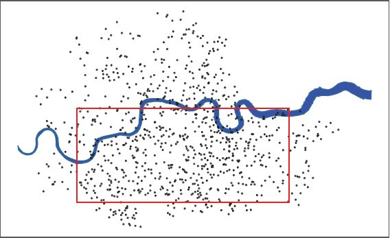
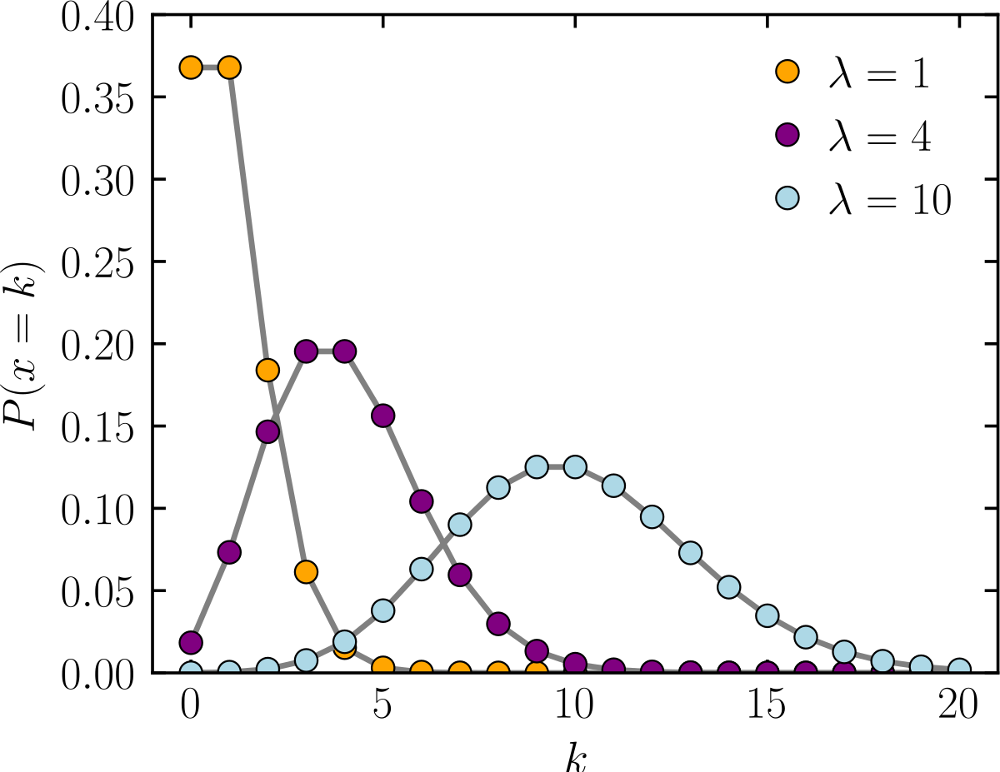

# Replication Materials for "The Flying Bomb and the Actuary" (Shaw and Shaw, 2019)


In a 2019 edition of [*Signifance*](https://www.significancemagazine.com/), Luke Shaw and Liam Shaw have an [interesting article](shaw_and_shaw.pdf) on so-called "flying bombs" from the Second World War. Specifically, Shaw and Shaw study the bombing of London, by German [V1 'doodlebugs'](https://en.wikipedia.org/wiki/V-1_flying_bomb)  and [V2 rockets](https://en.wikipedia.org/wiki/V-2_rocket).  These were especially common in South London, and many fell in my hometown of [Carshalton](https://www.bbc.co.uk/history/ww2peopleswar/stories/15/a2099315.shtml). 

The authors revisit earlier work by RD Clarke, an actuary and statistician.  His interest was in whether the bombs were targeted, or fell 'randomly'. In his original article (["An application of the Poisson distribution"](https://www.cambridge.org/core/journals/journal-of-the-institute-of-actuaries/article/an-application-of-the-poisson-distribution/F75111847FDA534103BD4941BD96A78E), 1946) Clarke used the Poisson distribution as a null hypothesis. His method was to uniformly divide a map of (south) London into equal unit squares of land, and then count the number of V1 bombs that landed in each.  If these counts are Poisson distributed, this is *prima facie* evidence that the bombs were **not** targeted at specific places on the map.  That is, the way the bombs fell is consistent with what we would expect if they were dropped randomly.

# R code
In April 2021, I set out to replicate what the authors had done in the paper (which includes a replcation of Clarke). I noticed some discrepencies between my results, what is written in the paper and what the authors (helpfully) provided in their [replication archive](https://lukefshaw.netlify.app/the-flying-bomb-and-the-actuary-supplementary-analysis/).  In an email exchange, the authors agreed that what follows below is correct---at least in terms of the subset of results I replicated.  

## Figure 1: Clarke's original analysis

We begin with a replicate of Table 1 from Shaw & Shaw.  In what follows, bear in mind that the null hypothesis is that we have a Poisson distribution.  The Alternative Hypothesis is that we have something else.  So, if p>0.05 (or whatever the appropriate cut-off) we cannot reject the null of a Poisson.

The authors give the following value for lambda from the Clarke data: 
```
V1_lambda <- 537/576
```
To replicate Table 1,  we need the expected count of squares that will have each number of bombs under the null.  That is, we need to know how many squares on the map would we expect to have zero bombs under the null, how many would we expect to have one bomb hit under the null, how many would have two and so on. We calculate these as the Poisson probabilities evaluated for that count using the lambda estimated above and then multiplied by the total number of squares on the map (576). So, to start, we need the probabilities which we can get from the `dpois` function with the lambda above:
```
E_kzero <- dpois(0, V1_lambda)
E_kone <- dpois(1, V1_lambda)
E_ktwo <- dpois(2, V1_lambda)
E_kthree <- dpois(3, V1_lambda)
E_kfour <- dpois(4, V1_lambda)
```
The probability of a count of five or above is just the complement of the above.  So,
```
E_5plus <- 1 - sum(E_kzero, E_kone, E_ktwo, E_kthree, E_kfour)
```
Put this together---i.e. put the probabilities in the vector and multiply by 576 (the total number of bombs) to give the `expected` counts of squares for each number of hits:
```
expected_probs <- c(E_kzero, E_kone, E_ktwo, E_kthree, E_kfour, E_5plus)
expected <-  expected_probs*576 
```
Now we need the observed counts in terms of how many squares had zero bombs, how many had 1 bomb, 2, 3, 4 and 5 or more. These are given in the original Clarke:
```
observed <- c(229, 211, 93, 35, 7,1)
```
We can print out our table
```
tab <- data.frame("k"=0:5,"Expected"= expected, "Observed"=observed)

cat("\nReplicated Shaw and Shaw, Table 1:\n\n")
print(tab, row.names = FALSE)
cat("\n-----------------------")
```
It should look something like this:
| k | Expected | Observed |
| --------------- | --------------- | --------------- |
| 0 |  226.742723 | 229 |
| 1 | 211.390351  | 211 |
| 2 | 98.538731  | 93 |
| 3 | 30.622279 | 35 |
| 4 | 7.137224 | 7 |
| 5 |  1.568692 | 1 | 

which is, modulo rounding error, what Shaw and Shaw report.

Next, we use a [chisq goodness of fit test](https://rpubs.com/pg2000in/ChiSquareGoodnessFit). We will compare our observed counts to those we would expect under the null of a the Poisson with a lambda as given above. Note that R's built in function will get the degrees of freedom wrong (from our POV), because it is expecting a contingency table.  We'll fix that later.  It may also complain that some cell counts are too low. We will ignore that. For now then, just grab the statistic...
```
stat <- suppressWarnings( chisq.test(x = observed, p = expected_probs)$statistic )
```
And then ask for the probability of this value on df=4 (because we do number of rows-1 multiplied by number of columns -1 and then minus 1 at the end, because we have estimated a parameter in lambda).
```
pvalue <- 1- pchisq(stat, df=4) 
cat("\nNull hypothesis: observed counts follow a Poisson (lam=537/576).")
cat("\nProbability of observing these counts if null is true is...")
cat("\n p-value=",pvalue,"\n")
```
This is `large' (in that it is greater than 0.05) at 0.88.  So we cannot reject the null of the Poisson.  So far so good.

## Figure 2: Repeating Clarke for South London Sample
Shaw and Shaw try an exact replication of Clarke, by looking at South London and running his analysis again.  It differs slightly, because Clarke doesn't report the exact map, so Shaw and Shaw have to best-guess what aggregate area he was using.  Their lambda estimate is very similar, and everything else follows as expected (though see comment on their p-value below):

```
lambda2 <- 532/576
E_kzero2 <- dpois(0, lambda2)
E_kone2 <- dpois(1, lambda2)
E_ktwo2 <- dpois(2, lambda2)
E_kthree2 <- dpois(3,lambda2)
E_kfour2 <- dpois(4, lambda2)
E_5plus2 <- 1 - sum(E_kzero2, E_kone2, E_ktwo2, E_kthree2, E_kfour2)
```
Now, calculate the expected counts and probabilities: 
```
expected_probs2 <- c(E_kzero2, E_kone2, E_ktwo2, E_kthree2, E_kfour2, E_5plus2)
expected2 <-  expected_probs2*576 
```
Now we need the observed counts
```
observed2 <- c(237, 189, 115, 28, 6, 1)
```
Do the test:
```
stat2 <- as.numeric( suppressWarnings( chisq.test(x = observed2, p = expected_probs2)$statistic ) )
```
Calculate the probability of this value on df=4...
```
pvalue2 <- 1- pchisq(stat2, df=4) #0.18
```
Shaw and Shaw report 0.70 in their paper, but acknowledge the 0.18 is in fact correct.  In any case, we cannot reject the null of a Poisson. For completeness, let's  print our version of Table 2:
```
tab2 <- data.frame("k"=0:5,"Expected"= round(expected2,d=2), "Observed"=observed2)

cat("\nReplicated Shaw and Shaw, Table 2:\n\n")
print(tab2, row.names = FALSE)
cat("\n-----------------------")
```
## Figure 3: Shaw & Shaw extension to whole London County Region
In Fig 3 (and surrounding text), Shaw and Shaw extend the earlier analysis to the whole London County Region (so, not just South London). Now they get a somewhat different lambda, and considerably lower p-value (though see my comments below)

```
lambda3 <- 0.757
E_kzero3 <- dpois(0, lambda3)
E_kone3 <- dpois(1, lambda3)
E_ktwo3 <- dpois(2, lambda3)
E_kthree3 <- dpois(3,lambda3)
E_kfour3 <- dpois(4, lambda3)
E_5plus3 <- 1 - sum(E_kzero3, E_kone3, E_ktwo3, E_kthree3, E_kfour3)

expected_probs3 <- c(E_kzero3, E_kone3, E_ktwo3, E_kthree3, E_kfour3, E_5plus3)
expected3 <-  expected_probs3*1000
```
Now we need the observed counts
```
observed3 <- c(508, 306, 121, 51, 14, 0)
```
Do the test:
```
stat3 <- as.numeric( suppressWarnings( chisq.test(x = observed3, p = expected_probs3)$statistic ) )
pvalue3 <- 1 - pchisq(stat3, df=4) # 0.0000048
# ?? S&S report 0.02
```
I find the p-value to be 0.0000048.  So we can reject the null of a Poisson.  Shaw and Shaw report p=0.02, but now agree with my value.  For completeness, let's print our version of the table:
```
tab3 <- data.frame("k"=0:5,"Expected"= round(expected3, d=2), "Observed"=observed3)
cat("\nReplicated Shaw and Shaw, Table 3:\n\n")
print(tab3, row.names = FALSE)
cat("\n-----------------------")
```
Shaw and Shaw have the last entry of the 'expected' column in Figure 3 as 0.97---I believe this should be 1.11 (for the column to sum to 1000, as required).

## Figure 4: Shaw & Shaw extension to V2 Rockets
There are not as many V2 rockets so it is unclear if e.g. a category of "4 or more hits per square" (or "5 or more hits per square") makes sense: in those categories, the expected counts are essentially zero, so not really appropriate for a chisq test. But, let's replicate the procedure anyway.  First, the lambda is much smaller:
```
lambda4 <- 64/408
```
Using that value, we have: 
```
E_kzero4 <- dpois(0, lambda4)
E_kone4 <- dpois(1, lambda4)
E_ktwo4 <- dpois(2, lambda4)
E_kthree4 <- dpois(3,lambda4)
E_kfour4 <- dpois(4, lambda4)
E_5plus4 <- 1 - sum(E_kzero4, E_kone4, E_ktwo4, E_kthree4, E_kfour4)

expected_probs4 <- c(E_kzero4, E_kone4, E_ktwo4, E_kthree4, E_kfour4, E_5plus4)
expected4 <-  expected_probs4*408
```
The observed counts are
```
observed4 <- c(356, 41, 10, 1, 0, 0)
```
The test is
```
stat4 <- as.numeric( suppressWarnings( chisq.test(x = observed4, p = expected_probs4)$statistic ) )
pvalue4 <- 1- pchisq(stat4, df=4) # 0.0077
# ?? S&S report 0.19
```
So, a p-value of 0.0077, meaning we can reject the null of a Poisson.  Shaw and Shaw report 0.19, but agree with my figure.  For completeness, let's print our version of the table in Figure 4:
```
tab4 <- data.frame("k"=0:5,"Expected"= round(expected4,d=2), "Observed"=observed4)
cat("\nReplicated Shaw and Shaw, Table 4:\n\n")
print(tab4, row.names = FALSE)
cat("\n-----------------------")
```


